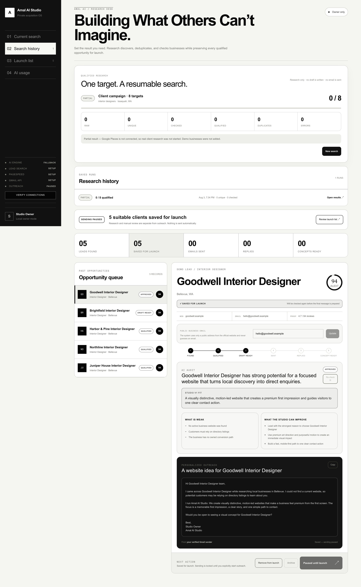
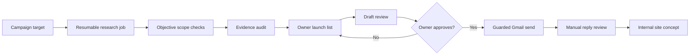
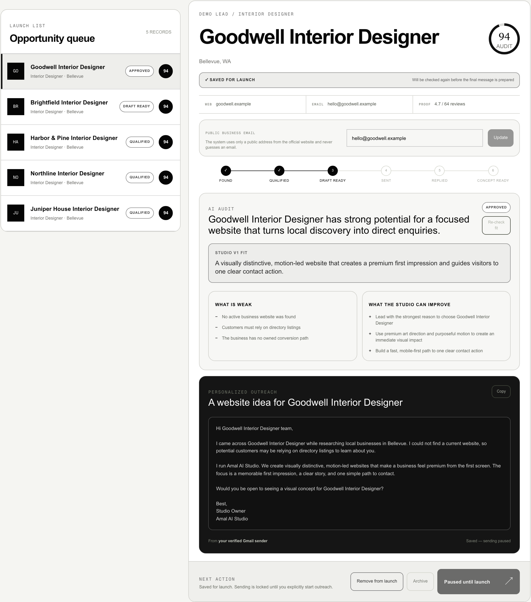
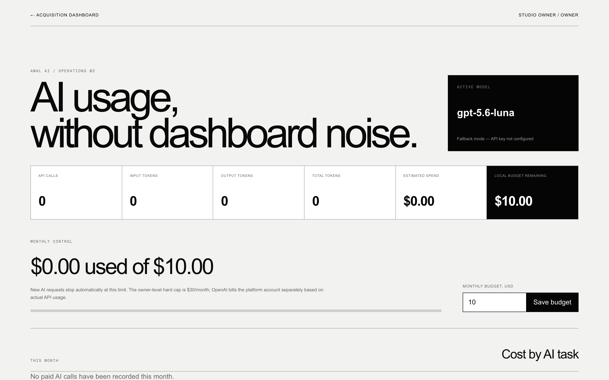

# Amal AI Studio — Human-Governed Client Acquisition OS

<p>
  
  
  
  
  
</p>

A full-stack, owner-controlled "operating system" for a small web studio. It
plans market research, discovers real local businesses, audits their websites
with evidence, drafts personalized outreach — and refuses to send a single
email, spend a single dollar, or publish anything without an explicit human
decision.

Built with **Next.js 16, React 19, TypeScript, Tailwind 4, Cloudflare Workers,
D1 (SQLite), and Drizzle ORM**. ~9,000 lines of application code with a
47-test regression suite covering migrations, budgets, auth, and send-safety.



> **Safe to explore without API keys.** The dashboard, local data layer,
> deterministic audits, outreach drafts, and synthetic `.example` leads work
> without credentials. Persistent real-business research pauses visibly until
> Google Places is configured. No email is sent in the default setup.

---

## Why I built this

I run a one-person web studio. The hardest part of a small studio is not
building websites — it is *finding* the businesses that genuinely need one,
checking that they fit what you can actually deliver, and reaching out in a
way that is personal, honest, and legally compliant. Done by hand, that is
hours of repetitive research per day.

So I built my own acquisition OS with one hard rule: **automation does the
research, a human makes every decision that touches another person.** The
system can discover, dedupe, audit, and draft, while external actions stay
behind explicit owner approval, server-side configuration, budget controls,
and a kill switch that defaults to off.

This repository is the generalized, de-branded version of that system: the
studio identity is configurable, the demo mode needs no keys, and all of the
production lessons (D1 parameter limits, idempotent migrations, atomic
send-claims) are kept intact with their regression tests.

## System at a glance



Research state lives in Cloudflare D1. OpenAI, Google Places, PageSpeed, Gmail,
and the external website-intake adapter are optional server-side integrations;
each fails closed when its configuration is absent.

## How the search works

The research pipeline is a persistent, resumable job — not a one-shot script:

1. **Plan.** You set one number: how many qualified opportunities you need
   (1–50). A campaign director (OpenAI, or a deterministic fallback) turns it
   into a set of concrete market searches — e.g. *"interior designers ·
   Bellevue, WA"* — biased toward independent service businesses and away
   from portals, franchises, and direct competitors.
2. **Discover.** Each search runs against **Google Places Text Search (New)**
   with pagination. Raw results are stored in D1 and deduplicated by a stable
   source key, so a business found twice never becomes two leads.
3. **Objective scope check.** Deterministic code — never the AI — decides
   eligibility. Businesses that require portals, logins, online booking,
   e-commerce, or a large CMS are excluded, because the studio's V1 offer is
   a focused marketing/portfolio site. Visual taste and PageSpeed scores are
   *never* eligibility criteria.
4. **Evidence audit.** For eligible businesses the system fetches the public
   website safely (redirect revalidation, size/content-type limits), pulls
   **PageSpeed Insights** mobile performance/accessibility/SEO scores, and
   asks OpenAI for a short personalization summary. Without keys, a
   deterministic fallback audit is produced instead.
5. **Save for launch.** Qualified leads land in a durable, keyset-paginated
   Launch list that survives later searches. The job stops exactly at your
   target or records a precise reason why it stopped early — it never
   silently under-delivers.

Every step is bounded (D1 parameter limits, work-per-request caps, leases),
so an interrupted job can be resumed from the dashboard at any time.

## What happens after a client is found

The pipeline continues, but the autonomy stops:

| Stage | Who acts | What happens |
| --- | --- | --- |
| `found → qualified` | System | Objective scope checks + evidence audit |
| `qualified → drafted` | System | Personalized outreach draft (AI or fallback) for review |
| `drafted → approved` | **Owner** | You read and explicitly approve the exact message |
| `approved → sending → sent` | **Owner** | Send via Gmail API — only with the kill switch on, a compliance postal address, and a verified public business email. The `approved → sending` transition is claimed atomically so a retry can never double-send |
| `sent → replied` | **Owner** | Replies are read in Gmail and recorded manually — the system never reads inboxes |
| `replied → concept_ready` | System | An internal website concept (copy, sections, visual direction) is generated for owner review. It is never deployed or delivered automatically |



## Quick start (no keys required)

Requires Node.js `>= 22.13.0`.

```bash
git clone https://github.com/AmalEN20/amal-ai-studio.git
cd amal-ai-studio
npm ci
cp .env.example .env.local
```

Open `.env.local` and set:

```
ALLOW_LOCAL_OWNER_BYPASS=true
```

Then:

```bash
npm run dev
```

Open `http://localhost:3000`. With every API key left empty the system uses
synthetic `.example` businesses for the manual demo-lead path and deterministic
fallback generators for audits and drafts. The persistent research-job path
reports a clear partial result until Google Places is connected. Nothing is
sent, spent, or published in this setup.

`ALLOW_LOCAL_OWNER_BYPASS=true` works only on `localhost` and is ignored
entirely when `NODE_ENV=production`.

## The dashboard, explained

**Left sidebar, top — navigation.**
`01 Current search` shows the live queue of the active research run.
`02 Search history` keeps every saved run and its results.
`03 Launch list` is the durable list of qualified, owner-saved opportunities.
`04 AI usage` opens the spending ledger.

**Left sidebar, bottom — integration status lights.** Each row reflects a
real connection state:

| Status | Meaning |
| --- | --- |
| `Live` | The API key is configured and the last check succeeded |
| `Fallback` | No key — the deterministic offline generator is used instead |
| `Setup` | No key configured yet for this integration |
| `Paused` | Outreach sending is intentionally disabled (kill switch off) |

The **Verify connections** button performs live checks against Google
Places, PageSpeed, and Gmail and reports exactly what is ready.

**AI usage page.** Every OpenAI call is metered into a D1 ledger with an
atomic reserve/settle cycle and a hard monthly USD cap enforced at the
database level — the system cannot overspend even under concurrent requests.
The page shows the remaining local budget, per-feature usage, and lets the
owner adjust the monthly budget within the hard cap.



## Connecting the real APIs

Everything activates independently — add only the keys you want. All keys are
server-side only and never reach client code.

| Variable | Powers | Where to get it |
| --- | --- | --- |
| `STUDIO_NAME`, `SENDER_NAME` | Your identity in drafts and email headers | — |
| `OPENAI_API_KEY`, `OPENAI_MODEL` | Campaign plans, audit summaries, outreach drafts | platform.openai.com |
| `GOOGLE_PLACES_API_KEY` | Real local-business discovery | Google Cloud Console → enable *Places API (New)* |
| `PAGESPEED_API_KEY` | Mobile performance/accessibility/SEO evidence | Google Cloud Console → *PageSpeed Insights API* |
| `GMAIL_CLIENT_ID`, `GMAIL_CLIENT_SECRET`, `GMAIL_REFRESH_TOKEN`, `GMAIL_SENDER` | Approval-gated email sending | Google Cloud OAuth client (`gmail.send` scope) + a refresh token for the sending account |
| `OUTREACH_POSTAL_ADDRESS` | Legally required postal address in every commercial email | Your registered business address / PO Box |
| `OUTREACH_LAUNCH_ENABLED` | Master kill switch for real sending | Keep `false` until an intentional launch |
| `OWNER_EMAIL` | Owner allowlist — required for every hosted deployment | Your email |

Copy `.env.example` to `.env.local` and fill in values. For hosted
deployments, set the same names in your platform's secret store. The optional
`EVELE_WEBSITE_*` variables belong to a fail-closed adapter for handing
generated concepts to an external site pipeline; leave them empty unless you
build that integration.

### Outreach launch checklist

- Keep `OUTREACH_LAUNCH_ENABLED=false` during research and testing.
- Before enabling: verify the recipient's public email, the final text of
  every message, and `OUTREACH_POSTAL_ADDRESS`.
- Every message carries an unsubscribe line; opt-outs are suppressed
  permanently.

## Security model

- **Fail closed.** Missing configuration degrades to safe demo/fallback
  behavior or a visible refusal — never to an unsafe default.
- **Human in the loop.** No message sent, no money spent, nothing published
  without an explicit owner action.
- **Owner allowlist.** Hosted deployments require `OWNER_EMAIL`; every API
  route is guarded server-side. The localhost bypass is hard-disabled in
  production builds.
- **Budget caps.** Atomic reserve/settle accounting with a database-enforced
  hard monthly USD cap.
- **Send-claim locking.** `approved → sending` is claimed atomically;
  ambiguous Gmail failures (timeouts, 5xx) are treated as "may have sent"
  and block automatic retries that could double-email a real business.
- **Safe website fetching.** Redirect revalidation, response size and
  content-type limits, and no reflection of raw SQL or parameters into the
  UI on errors.

## Engineering highlights

Real production problems solved here, each with a regression test:

- **D1's 100-bound-parameter limit** — inserts and hydration queries are
  batched to stay under Cloudflare D1's per-statement cap (a 20-row lead
  insert once generated 480 parameters and failed live).
- **Idempotent forward-only migrations** — clean, legacy, and partially
  migrated databases converge without data loss; compound trigger bodies are
  installed at a guarded runtime boundary because hosted migration runners
  split SQL at internal semicolons.
- **Keyset pagination** — the Launch list is complete and stable across
  searches instead of being derived from a bounded recent-leads window
  (which once made 100 saved leads display as 36).
- **Deterministic fallback paths** — audits, drafts, and synthetic demo leads
  remain reviewable without external credentials, while real-business research
  stops explicitly when Google Places is unavailable.

## Verification

```bash
npm run typecheck   # Wrangler type generation check + standalone tsc
npm run lint
npm test            # production build + 47-test regression suite
npm audit --omit=dev
```

## Key files

- [`app/components/Dashboard.tsx`](app/components/Dashboard.tsx) — research console, queues, integrations
- [`app/components/LeadDetail.tsx`](app/components/LeadDetail.tsx) — audit card, outreach review, site concept preview
- [`app/api/research/jobs/step/route.ts`](app/api/research/jobs/step/route.ts) — bounded, resumable research steps
- [`lib/lead-engine.ts`](lib/lead-engine.ts) — Places, PageSpeed, OpenAI, and deterministic fallbacks
- [`lib/campaign-director.ts`](lib/campaign-director.ts) — target-driven market planning
- [`lib/gmail.ts`](lib/gmail.ts) — safe Gmail sending with send-claim protection
- [`lib/owner-auth.ts`](lib/owner-auth.ts) — owner allowlist and dev-only localhost bypass
- [`db/`](db/) — D1 persistence, budget ledger, schema guards
- [`docs/research-pipeline.md`](docs/research-pipeline.md) — the research job contract in depth
- [`docs/e2e-flow-audit.md`](docs/e2e-flow-audit.md) — honest audit of what is real vs. missing

## Honest scope

This is a working owner-controlled MVP, not a hosted SaaS. It contains no invented
customers, revenue, or performance claims. Generated "concepts" are internal
drafts for owner review — the system never publishes or delivers websites on
its own, and the client-delivery half (quotes, payments, deployment) is a
data foundation, not a finished product.
