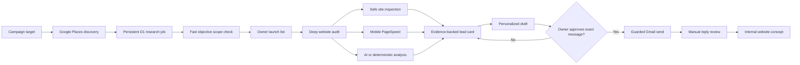

# Amal AI Studio

## AI Acquisition & Website Intelligence OS

<p>
  
  
  
  
  
  
</p>

A full-stack operating system for a small web studio: discover real businesses,
inspect their websites, measure the mobile experience with PageSpeed Insights,
build evidence-backed opportunity audits, and prepare personalized outreach —
with a human approving every action that reaches another person.


## What the system does

| Capability | What is implemented |
| --- | --- |
| Market discovery | Google Places Text Search with pagination, durable research jobs, deduplication, resumable progress, and explicit stop reasons |
| Website intelligence | Safe public-site inspection plus Google PageSpeed Insights in mobile mode |
| Evidence audit | Performance, Accessibility, and SEO scores combined with website structure, trust signals, and conversion-path analysis |
| Opportunity qualification | Deterministic fit checks for portals, booking, ecommerce, large content requirements, and direct competitors |
| Launch list | Persistent, keyset-paginated queue that keeps qualified opportunities across later searches |
| Outreach workspace | AI-assisted or deterministic drafts, exact owner approval, Gmail send locking, and manual reply tracking |
| AI cost control | Atomic usage reservation and settlement with a database-enforced monthly hard cap |
| Client workflow foundation | Durable quote, payment, intake, build, QA, approval, deployment, and event models for the next product phase |

The result is not a generic lead scraper. It is a controlled research and
decision system that keeps the evidence, operational state, and next action for
every opportunity in one place.

## Mobile website intelligence

Website analysis is a first-class part of the product.

When the owner runs **Run AI audit** or **Re-check fit**, the system:

1. Safely fetches the public website with redirect revalidation, timeout,
   content-type, response-size, and private-network protections.
2. Detects functionality that changes project scope: portals, account areas,
   online booking, ecommerce, reservations, paid memberships, and unusually
   large site structures.
3. Calls Google PageSpeed Insights with `strategy=mobile`.
4. Collects three Lighthouse category scores:
   - **Mobile Performance**
   - **Accessibility**
   - **SEO**
5. Saves the results inside the lead audit and displays them directly in the
   opportunity card.
6. Uses measured evidence in the outreach angle only when the measurement
   exists. A low score is never invented or guessed.


The bulk research loop intentionally performs a fast objective scope pass first.
PageSpeed runs during the deeper owner-requested audit, after unsuitable portal,
booking, commerce, or large-site leads have already been rejected. This keeps
large searches faster and protects API quota without removing website-speed
analysis from the product.

PageSpeed is treated as diagnostic evidence, not as an automatic rejection
rule. A business is qualified by whether the studio can honestly deliver the
required website; its current visual style or Lighthouse score does not decide
eligibility. The mobile Lighthouse profile is also not presented as a substitute
for later hands-on responsive testing across real devices.

## How the workflow fits together



Research never sends email. Discovery, qualification, drafting, approval, and
sending are separate state transitions with separate safety gates.

## Research that survives real failures

The research pipeline is persistent rather than browser-session based:

- The owner chooses an exact target from 1 to 50 qualified opportunities.
- Campaign planning creates multiple market searches for that target.
- Every run, candidate, counter, page token, lease, and stop reason is stored in
  Cloudflare D1.
- Canonical businesses are deduplicated while retaining membership in every
  research run where they appeared.
- Work is bounded per request and can resume after a reload or interruption.
- The run finishes only when it reaches the target or records a precise partial
  result explaining why it stopped.

This avoids silent under-delivery and keeps a later search from erasing earlier
qualified opportunities.

## Human control at the important boundaries

| Stage | System responsibility | Human responsibility |
| --- | --- | --- |
| Discover | Find and deduplicate public business records | Choose the research target |
| Qualify | Apply objective service-fit rules | Review borderline cases |
| Audit | Inspect the site and collect mobile PageSpeed evidence | Decide whether the opportunity is worth pursuing |
| Draft | Produce a personalized starting point | Review and approve the exact wording |
| Send | Enforce configuration, compliance, and atomic send claiming | Intentionally enable outreach and trigger the send |
| Reply | Preserve the workflow state | Read Gmail and record the real response |
| Concept | Generate an internal website direction | Review before any delivery work |

No email is sent, no money is spent, and no website is published merely because
an AI produced an answer.

## Quick start

Requires Node.js `>= 22.13.0`.

```bash
git clone https://github.com/AmalEN20/amal-ai-studio.git
cd amal-ai-studio
npm ci
cp .env.example .env.local
```

Set the local-only owner bypass in `.env.local`:

```dotenv
ALLOW_LOCAL_OWNER_BYPASS=true
```

Start the application:

```bash
npm run dev
```

Open `http://localhost:3000`.

Without provider keys, the local dashboard, D1 state, synthetic `.example`
lead path, deterministic audits, and outreach drafts remain safe to explore.
Real-business research requires Google Places. Live mobile PageSpeed evidence
requires a PageSpeed API key. Real Gmail sending remains unavailable until all
send requirements are configured and the master launch switch is intentionally
enabled.

`ALLOW_LOCAL_OWNER_BYPASS=true` is accepted only on localhost and is ignored in
production.

## Optional integrations

Every integration is server-side and activates independently.

| Configuration | Capability |
| --- | --- |
| `OPENAI_API_KEY`, `OPENAI_MODEL` | Campaign plans, audit summaries, and outreach drafts |
| `GOOGLE_PLACES_API_KEY` | Real local-business discovery |
| `PAGESPEED_API_KEY` | Mobile Performance, Accessibility, and SEO evidence |
| `GMAIL_CLIENT_ID`, `GMAIL_CLIENT_SECRET`, `GMAIL_REFRESH_TOKEN`, `GMAIL_SENDER` | Approval-gated Gmail sending |
| `OUTREACH_POSTAL_ADDRESS` | Compliance address included in commercial outreach |
| `OUTREACH_LAUNCH_ENABLED` | Master switch for real sending; keep `OUTREACH_LAUNCH_ENABLED=false` until an intentional launch |
| `OWNER_EMAIL` | Required owner allowlist for every hosted environment |
| `STUDIO_NAME`, `SENDER_NAME` | Configurable identity used in drafts |
| `EVELE_WEBSITE_*` | Optional fail-closed adapter to an external website-intake pipeline |

The dashboard can verify Google Places, PageSpeed, and Gmail connections and
reports whether each integration is live, waiting for setup, using a fallback,
or intentionally paused.

## Security model

- **Fail closed:** missing configuration produces a fallback or a visible
  refusal, never an unsafe default.
- **Owner-only APIs:** every operational route is guarded server-side.
- **Production-safe local bypass:** localhost convenience cannot enable hosted
  access.
- **Atomic AI budget:** reserve and settle accounting prevents concurrent calls
  from exceeding the hard monthly cap.
- **Atomic send claim:** `approved → sending` is claimed before Gmail is called,
  preventing concurrent duplicate sends.
- **Ambiguous-send protection:** timeouts and provider 5xx responses do not
  trigger an automatic retry that could email the same business twice.
- **SSRF-resistant inspection:** public-site fetching rejects local, private,
  credentialed, redirected-to-private, oversized, and non-HTML destinations.
- **Secret hygiene:** environment files, private hosting configuration, local
  Cloudflare state, and build output are excluded from version control.

See [`SECURITY.md`](SECURITY.md) for the repository security checklist.

## Engineering highlights

- **D1 parameter limits:** inserts and lookups are split below Cloudflare D1's
  100-bound-parameter limit.
- **Forward-only migrations:** clean, legacy, and partially migrated databases
  converge without deleting or fabricating data.
- **Runtime trigger installation:** compound SQLite triggers are installed at a
  guarded mutation boundary because hosted migration splitting cannot preserve
  their internal semicolons.
- **Stable launch-list pagination:** keyset pagination keeps older saved leads
  visible after later research runs.
- **Truthful status design:** generated concepts are represented as internal
  concepts, never as deployed or delivered client websites.
- **Deterministic fallbacks:** important flows remain reviewable without paid AI
  calls or external side effects.

## Verification

```bash
npm run typecheck
npm run lint
npm test
npm audit --omit=dev
```

The current regression suite contains 48 tests covering mobile PageSpeed
intelligence, research persistence, migrations, D1 limits, owner auth, AI budget
reservation, safe website fetching, send claiming, truthful workflow states,
and website-intake idempotency.

## Key implementation files

- [`lib/lead-engine.ts`](lib/lead-engine.ts) — safe inspection, mobile PageSpeed,
  deterministic qualification, AI audits, and outreach drafts
- [`app/components/LeadDetail.tsx`](app/components/LeadDetail.tsx) — website
  evidence, mobile scores, audit actions, and owner review
- [`app/api/research/jobs/step/route.ts`](app/api/research/jobs/step/route.ts) —
  bounded and resumable research execution
- [`db/research-jobs.ts`](db/research-jobs.ts) — persistent research state,
  leases, membership, counters, and recovery
- [`db/ai-usage.ts`](db/ai-usage.ts) — atomic AI budget ledger
- [`lib/gmail.ts`](lib/gmail.ts) — approval-gated sending and timeout handling
- [`lib/safe-website-fetch.ts`](lib/safe-website-fetch.ts) — public-network and
  response-boundary enforcement
- [`docs/research-pipeline.md`](docs/research-pipeline.md) — research contract
- [`docs/e2e-flow-audit.md`](docs/e2e-flow-audit.md) — honest current-scope audit

## Current product boundary

This is a working owner-controlled acquisition MVP, not a hosted multi-tenant
SaaS. Research, website inspection, PageSpeed evidence, opportunity management,
drafting, approval gates, and the guarded Gmail path are implemented. Quotes,
payments, customer intake, builds, QA, deployment, and delivery currently have a
durable data foundation but are not presented as a finished autonomous service.

The repository contains no invented customers, revenue, testimonials, or
performance results. Demo businesses use reserved `.example` domains, and
website-performance claims are made only when a real measurement exists.
